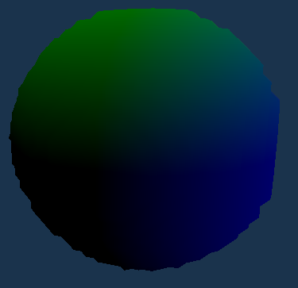

## What's This Article About?

When coding for a platform for the first time, it's tempting to assume that the platform's standards won't change much from what you're accustomed to. Typically, the logic remains consistent, regardless of the programming language, compiler/interpreter, and operating system in use.

However, GPUs challenge this "standard." When crafting a shader, its execution may vary across different machines or even on the same machine with a different OS or a distinct version of the same OS, or driver.

This article assumes you possess basic knowledge of C++, Modern OpenGL, GLSL, and matrix/vector math. If you can draw a cube and implement a flying camera using OpenGL, you should be well-prepared. Consider referring to the initial chapters of [learnopengl.com](https://learnopengl.com) to solidify your understanding of the fundamentals.


## Why This Topic?

I selected this topic because, as a relatively novice GPU programmer, I've encountered mistakes that took considerable time to detect. These errors later caused complications in different areas, making them challenging to pinpoint and fix.

These mistakes aren't always apparent, and on certain platforms, they may not even be considered errors. For instance, Nvidia GPUs adhere to different standards regarding memory alignment, priorities, profiling, etc., compared to AMD, or Intel GPUs.


## The Problem

I wanted to create a 3D Constructive Solid Geometry (CSG) editor, utilizing Signed Distance Fields (SDF) to define shapes as mathematical functions. The approach involved sampling the values of combined objects in a 3D grid of points. I would then send the data to a Marching Cubes algorithm to construct a mesh, and eventually render it using a basic shader.

Below is a condensed version of the C++ function responsible for generating vertices and indices for draw order through the Marching Cubes algorithm. The original function, spanning almost 200 lines, has been significantly simplified for conciseness.
```cpp
MeshData build_mesh(VoxelGrid voxels) {
    vector<vec3f> vertices;
    vector<int> indices;
    for (const auto& [position, value] : voxels) {
        // Calculate the "zero point" between each corner of the voxel
        vec3f new_vertices[] = calculate_vertex_position_in_voxel(position, value);

        // This function is the core of the algorithm, searching through a table with 256 possible vertex orders
        // The large size is why I obfuscated it here; you can find a "connection table" for Marching Cubes easily
        int new_indices[] = calculate_indices_for_voxel(position, voxels);

        // Some vertices might not be used if the "zero point" of the corners isn't between them
        vertices.emplace_back(eliminate_unused_vertices(new_vertices));
        indices.emplace_back(new_indices);
    }
    return MeshData{ vertices, indices };
}
```

While this algorithm is efficient and easy to adapt for multithreading, issues arise when attempting real-time execution, generating the mesh every frame. The data sent to the GPU for drawing grows exponentially with the voxel grid resolution.

Uploading data to the GPU becomes a bottleneck, posing a challenge for real-time operation even on higher-end machines, and it's particularly hindered by bus speeds.


## The Solution
The most straightforward solution to the issue of transfer speeds between the CPU and GPU is to eliminate the need for this transfer altogether. A key advantage of this approach is that running the mesh generation code on the GPU allows us to leverage the inherent parallelism of GPUs, as they are specifically designed for such computational work.

Here is a simplified version of the compute shader responsible for generating vertex positions:

```glsl
// Buffer binding for the vertex data
layout(std430, binding = 0) buffer VertexData {
    vec3 vertex_data[];
};

void main() {
    // The position we're currently working at
    uvec3 pos = gl_GlobalInvocationID.xyz;

    // Get the voxel data
    float current_voxel_data[8] = generate_voxel_values(pos);

    // Loop through all 8 corners of the voxel and add them to the vertex list if inside the surface
    uint indices_order = 0;
    for (int i = 0; i < 8; i++)
        if (current_voxel_data[i] <= 0.0f)
            indices_order |= (1 << i);

    // Generate the zero point between each corner of the voxel
    vec3 verts[12];
    gen_voxel_verts(verts, pos, current_voxel_data);

    // Add the vertices to the vertex list
    uint indices_start = indices_order * 15;
    uint output_index = data_index(pos) * 15;
    for (int i = 0; i < 15; i += 3) {
        uint target_index = output_index + i;
        if (indices[indices_start + i] != -1) {
            // Add the face, made of 3 vertices, to the vertex list
            vertex_data[target_index] = verts[indices[indices_start + i + 2]];
            vertex_data[target_index + 1] = verts[indices[indices_start + i + 1]];
            vertex_data[target_index + 2] = verts[indices[indices_start + i]];
        }
    }
}
```

This way, the `vertex_data` array is already on the GPU. When drawing the mesh, we simply bind the array to the appropriate locations and execute the draw commands. Binding the buffers alone significantly reduces strain on the bus, and the CPU only needs to send draw and dispatch commands, a process much faster than transmitting millions of vertices.

Creating the buffers is straightforward in C++:

```cpp
// Create and bind the buffer
glCreateBuffers(1, &vertex_buffer);
glBindBuffer(GL_SHADER_STORAGE_BUFFER, vertex_buffer);

// Allocate memory for the buffer without sending data
// Using nullptr as the last argument tells OpenGL to not send any data
glBufferData(GL_SHADER_STORAGE_BUFFER, sizeof(vec3) * num_vertices, nullptr, GL_STATIC_DRAW);
```

Once created, the buffer remains unchanged unless the mesh size changes. When needed, it is bound to the appropriate location, and either the compute shader generates the data or the existing data is drawn:

```cpp
// Bind the buffer
glBindBuffer(GL_SHADER_STORAGE_BUFFER, vertex_buffer);
glBindBufferBase(GL_SHADER_STORAGE_BUFFER, 0, vertex_buffer);

// Calculate work group dispatch size
vec3 dispatch_size = voxel_grid_size / work_group_size;
// Dispatch the compute shader
glDispatchCompute(dispatch_size.x, dispatch_size.y, dispatch_size.z);

// Assuming the buffer is still bound in the same way, draw the mesh
// NOTE: In OpenGL 4.2 and up, the buffer must be bound to a Vertex Array Object (VAO) before drawing
glDrawArrays(GL_TRIANGLES, 0, num_vertices);
```

This GPU implementation offers improved speed and elegance compared to the previous version but has a few inherent challenges.


## Unforeseen Problems
With the GPU implementation of the algorithm in place, running the code reveals several issues. Either the mesh fails to render, or triangles from garbage data appear across the screen, and no errors are reported in the console.

If you're lucky, you might see a shape resembling the one intended through the visual clutter. However, its accuracy falls short of the desired outcome.


### Extra Triangles
First of, let's look at those triangles stretching in weird directions.
<br>

<br>
If you were paying attention earlier when writing the compute shader, you might have noticed that when we don't use a vertex, we don't simply omit it from the vertex list; instead, we skip any processing related to it.

Consequently, many vertices in the buffer remain untouched. Vertices not generated by the compute shader retain the garbage data they were initialized with.

Fortunately, this initial problem has a relatively straightforward solution.
We need to clear the buffer before any data is written to it to eliminate any pre-existing garbage data.
Since the clear shader is simple, I'll show it here in its entirety:
```glsl
#version 450 core

// We don't need to worry about working in 3D space here, so we can just use a 1D work group
layout(local_size_x = 64, local_size_y = 1, local_size_z = 1) in;

// The buffer we want to clear
layout(std430, binding = 0) buffer buff {
    uvec3 data[];
};

void main() {
	// Set the value of each element in the buffer to 0
    data[gl_GlobalInvocationID.x] = uvec3(0);
}
```
Now all we need to do is bind the vertex buffer to the appropriate location, and dispatch the clear shader.
```cpp
// Bind the buffer to the appropriate location
glBindBuffer(GL_SHADER_STORAGE_BUFFER, vertex_buffer);
glBindBufferBase(GL_SHADER_STORAGE_BUFFER, 0, vertex_buffer);

// Dispatch the clear shader
glDispatchCompute(num_vertices / 64, 1, 1);
```
Although the buffer is of type uvec3 (containing 3 unsigned integers) rather than vec3 (containing 3 floats), it does not impact the process.
Both floats and unsigned integers are 32 bits long, and using unsigned integers simplifies the operation without compromising functionality.

Good, we fixed it, and when we run it, we get a mesh that looks like this:
<br>

<br>
Wait, it's still broken? What's going on?


### Memory Alignment
At least we don't get all those garbage triangles anymore, but now there's an entire section of the mesh missing.
It's worth noting that the missing piece consistently appears in the same location and maintains the same size, assuming the voxel grid size remains constant.

If you've followed online instructions on using compute shaders, you might have defined buffers in the compute shader like this:
```glsl
layout(std430, binding = 0) buffer VertexData {
	vec3 vertex_data[];
};
```

Technically, this is not incorrect, and it might seem to work on NVidia GPUs or select AMD GPUs. However, the underlying problem arises from how different GPUs handle memory alignment, compounded by the lack of a concrete standard in OpenGL for memory alignment, leaving room for interpretation by GPU manufacturers.

The primary issue lies with `std430`, a layout qualifier that only loosely specifies that memory should be tightly packed. However, OpenGL allows different rules, especially for vec3, which is the type used for the vertex buffer.

For example, Intel GPUs will align the 12 byte vec3 buffer to 16 bytes, resulting in a structure like this:
```
[ X Y Z _ X Y Z _ X Y Z _ X Y Z _ ]
```
Here, `_` represents an empty space equivalent to the size of a float (4 bytes).

A more defined standard is `std140`, which mandates that vec3, along with other types, should be aligned to 16 bytes, regardless of their size.
While it retains the less efficient alignment of a vec4, introducing some empty space, this alignment rule is no longer inconsistent across different GPUs.

To rectify this alignment issue, we need to do 2 things:

- Change any occurrence of `std430` with `std140`
Here's the modified shader alongside the original one:

```glsl
// Old
layout(std430, binding = 0) buffer VertexData {
	vec3 vertex_data[];
};

// New
layout(std140, binding = 0) buffer VertexData {
	vec3 vertex_data[];
};
```

- Allocate memory for a buffer of vec4 instead of vec3.
Here's the modified line alongside the original one:

```cpp
// Old
glBufferData(GL_SHADER_STORAGE_BUFFER, sizeof(vec3) * num_vertices, nullptr, GL_STATIC_DRAW);

// New, with the size of vec4 instead of vec3
glBufferData(GL_SHADER_STORAGE_BUFFER, sizeof(vec4) * num_vertices, nullptr, GL_STATIC_DRAW);
```

With this simple adjustment, the resulting mesh now looks like this:
<br>

